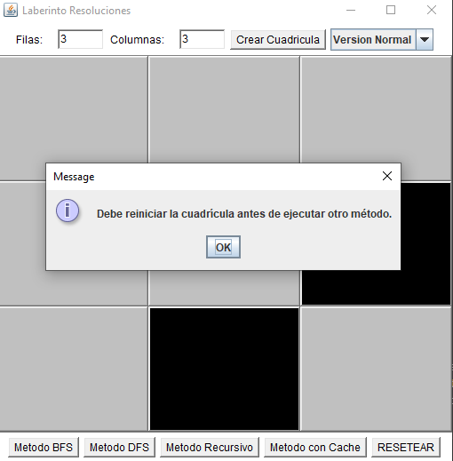

                               Universidad Politécnica Salesiana   
 
                                  Informe del Proyecto Final

______________________________________________________________________________________________________________ 
                           
            

Carrera: Ingeniería en Computación    

Materia: Estructura de Datos

Docente: Pablo Andrés Torres Peña

_______________________________________________________________________________________________________________

Integrantes:

Leo Fernando Vasconez Jarrin Correo: lvasconezj@est.ups.edu.ec

Jefferson Xavier Guerrero Sisalima Correo: jguerreros3@est.ups.edu.ec
_______________________________________________________________________________________________________________

Descripción del Problema

El problema planteado consiste en encontrar una ruta óptima en un laberinto definido como una matriz de celdas. Cada celda puede ser transitable o no transitable. Se define un punto de inicio (A) y un punto de destino (B).
___________________________________________________________________________

Propuesta de Solución

Marco Teórico:

-	Programación Dinámica: Es una técnica de optimización que permite resolver problemas dividiéndolos en subproblemas más pequeños y almacenando los resultados de estos subproblemas para evitar cálculos redundantes.
BFS (Breadth-First Search): Es un algoritmo de búsqueda que explora todos los nodos a una cierta distancia de la raíz antes de explorar nodos amayores distancias. Es útil para encontrar la  ruta más corta en grafos no ponderados.

-	DFS (Depth-First Search): Es un algoritmo de búsqueda que explora tan profundo como sea posible a partir de cada nodo antes de retroceder. Es útil para la exploración exhaustiva de un laberinto.
___________________________________________________________________________

Descripción de la Propuesta de Solución:

Se desarrollaron cuatro métodos para encontrar la ruta entre los puntos A y B en el laberinto:

-	Método Recursivo Simple: Implementa una búsqueda en profundidad utilizando recursión para explorar todas las posibles rutas.

-	Método con Cache (Programación Dinámica): Mejora el método recursivo utilizando una cache para almacenar los resultados de subproblemas ya resueltos, evitando cálculos redundantes.

-	BFS (Breadth-First Search): Implementa una búsqueda en anchura para explorar todas las rutas a una cierta distancia antes de avanzar a rutas más lejanas.

-	DFS (Depth-First Search): Implementa una búsqueda en profundidad para explorar todas las posibles rutas desde el punto inicial.

___________________________________________________________________________

Herramientas y Lenguajes Utilizados:

Para la realizacion adecuada del proyecto se utilizo:

-	Lenguaje de Programación: Java
-	Herramienta para la Interfaz Gráfica: Java Awt y Java Swing

___________________________________________________________________________

Criterio por Integrante de su Propuesta:

Leo Fernando Vasconez Jarrin: Yo me enfoqué principalmente en la implementación de la interfaz grafica y de que el proyecto sea realizado usando el MVC para un mejor manejo de las clases, tambien ayude en corregir errores que se podian haber sucitado en la implementacion de los metodos BFS, DFS, recursivo y con cache. 

Jefferson Xavier Guerrero Sisalima: Me encargué de la implementación de todos los métodos del codigo en la clase Modelo.java del paquete Model, en esto realice todas las implementaciones para que los algoritmos de resolucion se ejecutaran adecuadamente implementando una clase Celda.java y agregando los demas metodo en la clase Modelo.java

___________________________________________________________________________

Capturas de la Implementación Final de la UI

1.	Interfaz Inicial 

2.	Interfaz con Cuadriculas Generadas 

3.	Implementación del Método BFS 

4.	Implementación del Método DFS 

5.	Implementación del Método Recursivo 

6.	Implementación del Método con Cache 

7.	Varias 

PRESIONAR RESETEAR SIN HABER CREADO LA CUADRICULA

CREAR CUADRICULA SIN ESPECIFICAR FILAS O COLUMNAS

CAMINO INNACESIBLE

PUNTO DE PARTIDA O FINAL BLOQUEADOS

ACCIONAR OTRO METODO SIN RESETEAR CUADRICULA

___________________________________________________________________________

Conclusiones

La mejor opción que concluimos que es para encontrar el camino más corto en el laberinto es el algoritmo BFS ya que este tiene la capacidad para explorar todas las rutas posibles a una cierta distancia antes de avanzar a rutas más lejanas, Lo cual nos garantiza encontrar el camino mas corto en grafos que no estan ponderados. 
___________________________________________________________________________

Consideraciones:

Leo Fernando Vasconez Jarrin:

Podríamos mejorar el proyecto implementando una interfaz más amigable a la vista ya que la que hicimos no puede resultar tan agradable a la vista.

Jefferson Xavier Guerrero Sisalima:

Yo creo que podriamos tambien implementar el metodo A* para que tambien podamos resolver el laberinto de esa
manera, dandole mas opciones al usuario que use el programa.

